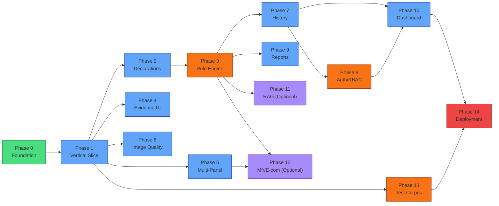

# DRISHTI — Development Phases

> **Historical planning document — not current implementation status.** This file preserves the original dependency-ordered development plan and its former future-tense/checklist language for project history. Multiple capabilities described below as planned, deferred, or optional are now implemented, while some planned roles and screens were not implemented. Do not use this document to determine current routes, roles, architecture, safety boundaries, or completion status. Use `README.md`, `docs/1-product.md`, `docs/2-architecture.md`, `docs/3-rules.md`, `docs/5-design.md`, `docs/6-absence-evaluation-safety.md`, and the application source instead.

> Phases are dependency-ordered, not time-estimated.
> Each phase must satisfy its exit criteria before the next phase begins.
> Do not implement future phases early.

---

## Phase 0 — Foundation and Planning

### Goal

Establish project structure, documentation, development environment, and base configuration.

### Why

Nothing can be built without a clean foundation. Documentation must precede code.

### Dependencies

None — this is the starting phase.

### What to Build

- [x] `/docs/1-product.md`
- [x] `/docs/2-architecture.md`
- [x] `/docs/3-rules.md`
- [x] `/docs/4-phases.md`
- [x] `/docs/5-design.md`
- [ ] Project directory structure (frontend/, backend/, tests/)
- [ ] `.gitignore`
- [ ] `.env.example`
- [ ] `README.md`
- [ ] `docker-compose.yml` (skeleton)
- [ ] Frontend scaffold (Vite + React + Tailwind)
- [ ] Backend scaffold (FastAPI + project structure)
- [ ] PostgreSQL Docker service
- [ ] Alembic initialization
- [ ] Basic health-check endpoint (`GET /api/health`)
- [ ] Verify all services start via `docker-compose up`

### Likely Files Affected

```
DRISHTI/
├── docs/*
├── frontend/ (scaffold)
├── backend/ (scaffold)
├── docker-compose.yml
├── .gitignore
├── .env.example
└── README.md
```

### Acceptance Criteria

- All five planning documents exist and are consistent.
- Frontend dev server starts and renders a blank page.
- Backend starts and responds to `GET /api/health`.
- PostgreSQL container starts and is reachable.
- Alembic is initialized.
- `docker-compose up` starts all services without errors.

### Tests

- `GET /api/health` returns `200 OK`.
- Frontend dev server responds on configured port.

### Failure Cases

- Docker not installed → document prerequisite.
- Port conflicts → document expected ports.

### What NOT to Build Yet

- Authentication
- Any UI screens
- Any processing pipelines
- Database models beyond health check

### Exit Criteria

All services start. Documentation is frozen. Development can proceed.

---

## Phase 1 — Minimal Vertical Slice

### Goal

Demonstrate the complete pipeline end-to-end:

```
Image → PaddleOCR → Structured Evidence → Small Rule Set → PASS / FAIL / REVIEW
```

### Why

The vertical slice proves that the core architecture works before investing in individual features. It is the foundation for the SIH demo.

### Dependencies

Phase 0 complete.

### What to Build

**Backend:**
- PaddleOCR integration (`ocr_engine.py`) — single image text extraction
- OCR result schema (text, confidence, polygon)
- Basic image upload endpoint (`POST /api/inspections/{id}/panels/{panel}/image`)
- Basic inspection creation endpoint (`POST /api/inspections`)
- Declaration extraction — raw OCR results stored as evidence
- 3–5 simple deterministic rules (MRP presence, manufacturer name presence, net quantity presence)
- Rule engine — evaluate extracted evidence against rules
- Evaluation endpoint (`POST /api/inspections/{id}/evaluate`)
- Findings endpoint (`GET /api/inspections/{id}/findings`)
- Evidence endpoint (`GET /api/inspections/{id}/evidence`)
- Basic error states: `OCR_PROCESSING_FAILED`, `INVALID_FILE_TYPE`

**Database:**
- `inspections` table
- `inspection_images` table
- `evidence` table
- `legal_rules` table (seeded with 3–5 rules)
- `findings` table
- Alembic migration

**Frontend:**
- Simple upload form (single image)
- Display OCR results (text, confidence)
- Display findings (PASS / FAIL / REVIEW per rule)
- Basic error display

### Likely Files Affected

```
backend/app/processing/ocr_engine.py
backend/app/engine/rule_engine.py
backend/app/engine/rule_selector.py
backend/app/engine/validators/presence.py
backend/app/models/inspection.py
backend/app/models/evidence.py
backend/app/models/rule.py
backend/app/models/finding.py
backend/app/schemas/inspection.py
backend/app/schemas/evidence.py
backend/app/schemas/finding.py
backend/app/api/routes/inspections.py
backend/app/api/routes/evidence.py
backend/app/services/inspection_service.py
backend/app/services/evidence_service.py
frontend/src/pages/NewInspection.jsx (basic)
frontend/src/services/api.js
```

### Acceptance Criteria

- Upload a JPEG image → receive OCR results with text, confidence, polygons.
- Evaluate inspection → receive PASS/FAIL/REVIEW for each seeded rule.
- A known-good product image with visible MRP returns PASS for MRP presence.
- PaddleOCR crash returns `OCR_PROCESSING_FAILED` (no fallback result).

> [!IMPORTANT]
> **Phase 1 is a technical proof-of-concept, not a full inspection.** A physical product must NOT be declared non-compliant for a "missing" declaration based on a single arbitrary image, because multi-panel completeness logic is not implemented until Phase 5.
>
> For Phase 1 FAIL testing, use **controlled test fixtures** where inspection completeness is explicitly known:
>
> ```
> Structured test evidence:
>   field: mrp
>   value: null
>   inspection_complete: true   # explicitly set in test fixture
> → expected result: FAIL
> ```
>
> For real physical-package inspections, absence-based FAIL decisions become valid only after Phase 5 complete-package inspection logic is implemented and all required panels have been captured and processed.

### Tests

- `test_ocr_engine.py` — PaddleOCR returns results for a known test image.
- `test_rule_engine.py` — PASS/FAIL/REVIEW for known evidence sets.
- `test_api_inspections.py` — API endpoints return correct responses.

### Failure Cases

- PaddleOCR not installed → documented installation steps.
- Image too large → enforce upload size limit.
- Invalid file type → `INVALID_FILE_TYPE`.

### What NOT to Build Yet

- Multi-panel guided inspection
- Declaration classification (just store raw OCR)
- Image quality validation
- Authentication
- Dashboard
- Reports
- Any AI processing

### Exit Criteria

A single image can be uploaded, processed through PaddleOCR, and evaluated against 3–5 deterministic rules, producing PASS/FAIL/REVIEW results with evidence. Demonstrated via API and basic frontend.

---

## Phase 2 — Declaration Extraction and Normalization

### Goal

Transform raw OCR results into classified, normalized declarations.

### Why

Raw OCR text like `"MRP ₹50 incl. of all taxes"` must become structured data: `{ field: "mrp", value: "50.00", unit: "INR" }` for the rule engine to evaluate.

### Dependencies

Phase 1 complete (OCR pipeline working).

### What to Build

- Declaration classifier (`declaration_classifier.py`)
  - Pattern matching for MRP, net quantity, dates
  - Regex-based classification for initial scope
  - Confidence scoring for classification
- Text normalization
  - Unicode normalization
  - Common OCR error correction (₹ vs Rs, etc.)
  - Whitespace cleanup
- Declaration schemas (Pydantic)
- Updated evidence storage with `normalized_field` and `normalized_value`
- AI-assisted classification (optional, for ambiguous text only)
  - If introduced: ONE AI provider, no fallback
- Updated rule engine to evaluate normalized declarations

### Likely Files Affected

```
backend/app/processing/declaration_classifier.py
backend/app/schemas/evidence.py (updated)
backend/app/models/evidence.py (updated)
backend/app/engine/rule_engine.py (updated)
backend/app/engine/validators/format.py (new)
```

### Acceptance Criteria

- `"MRP ₹50.00 incl. of all taxes"` → `{ field: "mrp", value: "50.00" }`
- `"Net Wt: 200g"` → `{ field: "net_quantity", value: "200", unit: "g" }`
- Ambiguous text → `REVIEW` flag
- Unclassifiable text → stored but not classified (no fabrication)

### Tests

- `test_declaration_classifier.py` — known text → expected classification.
- `test_normalization.py` — known OCR artifacts → corrected output.

### Failure Cases

- Completely unrecognizable text → stored as raw evidence, not classified.
- Low-confidence classification → flagged `REVIEW_REQUIRED`.
- If AI-assisted classification has been introduced for a specific task and the AI service is unavailable → `AI_SERVICE_UNAVAILABLE` → preserve state → display Retry. No fallback to another implementation.

### What NOT to Build Yet

- Physical font-size measurement
- Image quality validation
- Multi-panel capture
- Reports

### Exit Criteria

OCR results are reliably classified into declaration categories with normalized values. Rule engine evaluates normalized declarations.

---

## Phase 3 — Deterministic Legal Metrology Rule Engine

### Goal

Build the full version-aware, deterministic legal rule engine.

### Why

The rule engine is DRISHTI's central compliance component. It must support structured rules with legal citations, versioning, and deterministic evaluation.

### Dependencies

Phase 2 complete (declarations are classified and normalized).

### What to Build

- Full `LegalRule` model with all fields (citation, versioning, applicability, etc.)
- Rule selector — select applicable rules by product category, package type, inspection date
- Validation types: `presence`, `format`, `value_range`, `text_match`
- Validator implementations for each type
- Structured findings with explanations and evidence references
- Rule seeding for initial declaration scope (8 declarations)
- Rule version management (effective_from, effective_until)
- Database migration for full rule schema

### Likely Files Affected

```
backend/app/models/rule.py (expanded)
backend/app/schemas/rule.py (expanded)
backend/app/engine/rule_engine.py (expanded)
backend/app/engine/rule_selector.py (expanded)
backend/app/engine/validators/base.py
backend/app/engine/validators/presence.py (expanded)
backend/app/engine/validators/format.py (expanded)
backend/app/engine/validators/value_range.py (new)
backend/app/engine/validators/text_match.py (new)
backend/app/services/rule_service.py
alembic/versions/ (new migration)
```

### Acceptance Criteria

- Rule selector returns only rules applicable to the given product/package/date.
- Expired rules (past `effective_until`) are not selected.
- Each finding includes: rule reference, legal citation, result, explanation, evidence IDs.
- Same evidence + same rules = same result (deterministic).
- All 8 initial declarations have at least one rule.

### Tests

- `test_rule_selector.py` — correct rules selected for different products/dates.
- `test_rule_engine.py` — comprehensive PASS/FAIL/REVIEW cases for all validators.
- `test_rule_versioning.py` — expired rules excluded, future rules excluded.

### Failure Cases

- No applicable rules found → `RULE_VERSION_UNAVAILABLE`.
- Rule evaluation error → `RULE_EVALUATION_FAILED`.
- **Malformed or invalid applicable rule** → `RULE_CONFIGURATION_ERROR`.
  - Stop evaluation of the affected applicable rule set.
  - Log the rule identifier and version.
  - Do NOT silently skip the rule.
  - Do NOT produce a final COMPLIANT result for that evaluation.
  - Expose a clear system error to the authorized user.
  - Invalid rules that are not applicable to the current inspection may be reported separately but do not block unrelated evaluations.

### What NOT to Build Yet

- Rule administration UI
- AI-assisted rules
- Physical measurement rules

### Exit Criteria

Rule engine correctly evaluates all 8 declaration types with version-aware rule selection. All validators tested. Findings are traceable.

---

## Phase 4 — Evidence Coordinates and Highlighting

### Goal

Enable visual evidence traceability: click a finding → see the highlighted region on the source image.

### Why

Evidence without visual context is incomplete. Inspectors and supervisors must see exactly where a declaration was found on the package.

### Dependencies

Phase 2 complete (evidence has polygon coordinates from OCR).

### What to Build

**Backend:**
- Evidence visualization endpoint — return annotated image with bounding boxes
- OpenCV-based evidence overlay rendering
- Evidence API with image coordinates

**Frontend:**
- Evidence viewer component
- Image display with bounding-box overlays (CSS/SVG/Canvas)
- Click finding → highlight corresponding evidence region
- Zoom and pan on evidence images
- Evidence gallery per inspection

### Likely Files Affected

```
backend/app/processing/cv_pipeline.py (evidence visualization)
backend/app/api/routes/evidence.py (updated)
frontend/src/components/evidence/EvidenceViewer.jsx
frontend/src/components/evidence/BoundingBox.jsx
frontend/src/components/evidence/ImageOverlay.jsx
frontend/src/pages/InspectionDetail.jsx (updated)
```

### Acceptance Criteria

- Clicking a finding highlights the source region on the original image.
- Bounding boxes accurately match OCR polygon coordinates.
- Multiple evidence items visible on the same image.
- Evidence images load quickly.

### Tests

- `test_cv_pipeline.py` — overlay rendering produces valid annotated image.
- Frontend: visual verification of bounding box positioning.

### Failure Cases

- Invalid polygon data → log error, display evidence without highlight.
- Image not found → clear error message.

### What NOT to Build Yet

- Physical measurement overlays
- Calibration visualization
- 3D package visualization

### Exit Criteria

Findings are visually linked to source image regions. Evidence viewer is functional and accurate.

---

## Phase 5 — Guided Multi-Panel Package Inspection

### Goal

Model the physical package and guide inspectors through capturing all required surfaces.

### Why

DRISHTI must not conclude a declaration is missing if the relevant package surface has not been inspected. Guided capture ensures inspection completeness.

### Dependencies

Phase 1 complete (basic inspection and image upload working).

### What to Build

**Backend:**
- Package panel model (FRONT, BACK, LEFT, RIGHT, TOP, BOTTOM)
- Panel states (NOT_REQUIRED, REQUIRED, CAPTURED, RETAKE_REQUIRED, PROCESSED)
- Panel requirement determination based on product type
- Inspection completeness check
- `INCOMPLETE_INSPECTION` result when required panels missing
- Panel status API endpoints

**Frontend:**
- Package visualization (SVG/schematic showing panel states)
- Guided capture UI — step-by-step panel progression
- Panel status indicators (✅ / ❌ / ⏳)
- Anime.js transitions for panel completion
- Stepper component for inspection workflow
- Camera/upload interface per panel

### Likely Files Affected

```
backend/app/models/inspection.py (panels)
backend/app/schemas/inspection.py (panel states)
backend/app/services/inspection_service.py (completeness logic)
backend/app/api/routes/inspections.py (panel endpoints)
frontend/src/components/inspection/PackageVisualizer.jsx
frontend/src/components/inspection/PanelCapture.jsx
frontend/src/components/inspection/InspectionStepper.jsx
frontend/src/pages/NewInspection.jsx (updated)
frontend/src/animations/panelTransitions.js
```

### Acceptance Criteria

- Inspector sees which panels are required, captured, and pending.
- Missing a required panel → `INCOMPLETE_INSPECTION` (not FAIL for missing declarations).
- Completing all required panels → inspection can be evaluated.
- Duplicate panel upload → `DUPLICATE_PANEL` warning.
- Panel states update in real-time.

### Tests

- `test_panel_completeness.py` — correct INCOMPLETE_INSPECTION for missing panels.
- `test_panel_states.py` — state transitions work correctly.

### Failure Cases

- **Product/package type cannot be reliably determined → `PACKAGE_TYPE_REVIEW_REQUIRED`.**
  - Do not invent required panel requirements for an unknown package type.
  - The system must explicitly request review/correction before continuing with package-specific completeness logic.
  - Do not default to any assumed panel set.
- Image upload fails for a panel → panel stays in `REQUIRED` state.

### What NOT to Build Yet

- 3D package visualization
- Automated panel detection from image
- Camera-based live capture (use file upload initially)

### Exit Criteria

Complete guided multi-panel inspection workflow functional. INCOMPLETE_INSPECTION correctly detected.

---

## Phase 6 — Image Quality and Calibrated Visual Metrology

### Goal

Validate image quality before processing. Add calibrated physical measurement capability.

### Why

Poor images waste processing time and produce unreliable evidence. Physical measurements require known-scale calibration. Calibrated visual metrology is a planned DRISHTI technical differentiator that must be validated before the final SIH demo.

### Dependencies

Phase 1 complete (basic image upload), Phase 5 preferably complete (multi-panel capture).

### What to Build

**Image Quality Validation:**
- Blur detection (Laplacian variance via OpenCV)
- Glare detection
- Lighting assessment
- Package/object detection (is this a packaged commodity?)
- Image validation endpoint
- Quality feedback to inspector (retake reasons)

**Calibrated Visual Metrology:**
- ArUco / ChArUco marker detection (OpenCV)
- Perspective correction using detected markers
- Pixel-to-mm calibration
- Character dimension measurement from OCR polygons
- `PHYSICAL_MEASUREMENT_UNAVAILABLE` when no calibration marker present

> [!IMPORTANT]
> Calibrated visual metrology is a planned DRISHTI technical differentiator. Its implementation may be deferred until the core inspection workflow is stable, but before final SIH demo lock a **Go/No-Go validation** of at least one physically measurable presentation requirement must be performed.
>
> If reliable calibration cannot be demonstrated:
> - Keep `PHYSICAL_MEASUREMENT_UNAVAILABLE` as the explicit error.
> - Do not fake or estimate measurement.
> - Document the limitation clearly.
> - Do not remove the error state or substitute pixel-based guessing.

### Likely Files Affected

```
backend/app/processing/image_validator.py
backend/app/processing/cv_pipeline.py (calibration)
backend/app/schemas/inspection.py (quality results)
backend/app/api/routes/inspections.py (quality validation)
frontend/src/components/inspection/ImageQualityFeedback.jsx
```

### Acceptance Criteria

- Blurry image → `IMAGE_RETAKE_REQUIRED` with reason.
- Irrelevant object (person, laptop) → `INVALID_PACKAGE_IMAGE`.
- Empty image → `INVALID_PACKAGE_IMAGE`.
- Glare detected → `IMAGE_RETAKE_REQUIRED` with reason.
- Good quality image → accepted for processing.
- No calibration marker → `PHYSICAL_MEASUREMENT_UNAVAILABLE` (not estimated).

### Tests

- `test_image_validator.py` — blur, glare, empty, irrelevant object test images.
- `test_calibration.py` — ArUco detection on calibrated test images.

### Failure Cases

- OpenCV processing error → `IMAGE_PROCESSING_FAILED`.
- Calibration marker partially visible → `PHYSICAL_MEASUREMENT_UNAVAILABLE`.

### What NOT to Build Yet

- Real-time camera preview with quality overlay
- Advanced perspective correction for curved packaging

### Exit Criteria

Image quality validation rejects bad images with actionable feedback. Calibration measurement works with ArUco markers (if implemented in this phase).

---

## Phase 7 — Inspection Database and History

### Goal

Persist complete inspection lifecycle. Enable browsing, filtering, and reviewing past inspections.

### Why

Inspectors and supervisors need to access historical inspections for review, audit, and analysis.

### Dependencies

Phase 1 complete (basic inspection persistence), Phase 3 complete (full findings).

### What to Build

**Backend:**
- Complete inspection model (all metadata, product details, status tracking)
- Inspection status lifecycle (DRAFT → PROCESSING → COMPLETED → REVIEWED)
- List/filter/search inspections API
- Inspection detail API (full inspection with evidence and findings)
- Pagination support

**Frontend:**
- Inspection history page with filtering (status, date, product, violation type)
- Inspection list with summary cards
- Inspection detail view (full findings + evidence + metadata)
- Sort and pagination
- AnimatedList for inspection entries

### Likely Files Affected

```
backend/app/models/inspection.py (expanded)
backend/app/schemas/inspection.py (list/filter schemas)
backend/app/api/routes/inspections.py (list/filter endpoints)
backend/app/services/inspection_service.py (query logic)
frontend/src/pages/InspectionHistory.jsx
frontend/src/pages/InspectionDetail.jsx (expanded)
frontend/src/components/inspection/InspectionCard.jsx
frontend/src/components/common/Pagination.jsx
frontend/src/components/common/FilterBar.jsx
```

### Acceptance Criteria

- List inspections with pagination.
- Filter by status, date range, product category.
- View full inspection detail with all findings and evidence.
- Inspection status transitions are tracked.

### Tests

- `test_inspection_list.py` — pagination, filtering.
- `test_inspection_status.py` — status transitions.

### Failure Cases

- Database query timeout → `DATABASE_UNAVAILABLE`.
- No inspections found → empty state displayed.

### What NOT to Build Yet

- Supervisor approval workflow (Phase 8)
- Export/batch operations
- Analytics (Phase 10)

### Exit Criteria

Complete inspection history browsable, filterable, and detailed.

---

## Phase 8 — Authentication, RBAC, and Audit Integrity

### Goal

Implement user authentication, role-based access control, and evidence audit trail.

### Why

A regulatory inspection platform must control access and attribute every action to an authenticated user.

### Dependencies

Phase 7 complete (inspections persisted and browsable).

### What to Build

**Backend:**
- User model (username, email, password_hash, role, is_active)
- JWT authentication (login, refresh, logout)
- Argon2id password hashing
- RBAC middleware — enforce permissions per endpoint
- Inspection attribution (inspector_id on all inspections)
- Evidence integrity — SHA-256 hash on original images, timestamps, inspector attribution
- Supervisor workflow — review, approve, reopen inspections
- Audit log table (who did what when)

**Frontend:**
- Login page
- Session management (JWT storage, auto-refresh, logout)
- Role-based UI rendering (hide/show features per role)
- User profile page
- User management page (ADMIN)

### Likely Files Affected

```
backend/app/models/user.py
backend/app/schemas/auth.py
backend/app/core/security.py
backend/app/api/routes/auth.py
backend/app/api/routes/admin.py
backend/app/api/dependencies.py (auth dependency)
frontend/src/pages/Login.jsx
frontend/src/store/authContext.js
frontend/src/components/common/ProtectedRoute.jsx
```

### Acceptance Criteria

- Login returns JWT access + refresh tokens.
- Protected endpoints reject unauthenticated requests (401).
- Inspector cannot access ADMIN endpoints (403).
- Passwords stored with Argon2id.
- Every inspection attributed to the creating inspector.
- Evidence images have SHA-256 hash recorded.
- Supervisor can review and approve inspections.

### Tests

- `test_auth.py` — login, refresh, invalid credentials.
- `test_rbac.py` — role-based access for each endpoint.
- `test_evidence_integrity.py` — SHA-256 hashing.

### Failure Cases

- Invalid credentials → 401 with generic message (no user enumeration).
- Expired token → 401, frontend triggers refresh.
- Database unavailable during auth → `DATABASE_UNAVAILABLE`.

### What NOT to Build Yet

- OAuth / SSO integration
- Multi-factor authentication
- API rate limiting

### Exit Criteria

All endpoints are authenticated. RBAC enforced server-side. Evidence integrity established.

---

## Phase 9 — PDF and DOCX Reporting

### Goal

Generate professional inspection reports in PDF and DOCX formats.

### Why

Inspectors need official reports for enforcement actions, record-keeping, and legal proceedings.

### Dependencies

Phase 3 complete (full findings), Phase 7 complete (inspection history), Phase 8 preferably complete (inspector attribution).

### What to Build

**Backend:**
- PDF report generator (ReportLab)
- DOCX report generator (python-docx)
- Report template — official inspection report format
- Report contents: metadata, product details, findings table, evidence references, legal citations, compliance summary
- Report storage and retrieval
- Report generation endpoint
- Report download endpoint

**Frontend:**
- Report generation trigger (button on inspection detail)
- Report preview (in-browser for PDF)
- Report download
- Report generation state animation (Anime.js)

### Likely Files Affected

```
backend/app/services/report_service.py
backend/app/api/routes/reports.py
backend/app/models/report.py
backend/app/schemas/report.py
frontend/src/components/reports/ReportGenerator.jsx
frontend/src/components/reports/ReportPreview.jsx
frontend/src/pages/InspectionDetail.jsx (report section)
```

### Acceptance Criteria

- PDF report generated with all inspection data, findings, evidence, citations.
- DOCX report generated (editable by inspector).
- Report is professional and resembles official government inspection format.
- Report downloadable from frontend.
- `REPORT_GENERATION_FAILED` on failure (no partial/fake report).

### Tests

- `test_report_pdf.py` — PDF generates for known inspection data.
- `test_report_docx.py` — DOCX generates for known inspection data.

### Failure Cases

- Missing inspection data → `REPORT_GENERATION_FAILED`.
- ReportLab/python-docx error → `REPORT_GENERATION_FAILED`.

### What NOT to Build Yet

- Batch report generation
- Report templates administration
- Digital signatures

### Exit Criteria

Professional PDF and DOCX reports generated and downloadable for any completed inspection.

---

## Phase 10 — Dashboard and Regulatory Analytics

### Goal

Provide inspectors and supervisors with enforcement intelligence dashboards.

### Why

Supervisors need aggregate views of inspection volumes, compliance rates, violation trends, and inspector activity.

### Dependencies

Phase 7 complete (inspection history), Phase 8 complete (RBAC — supervisor role).

### What to Build

**Backend:**
- Dashboard statistics API (total inspections, compliance rate, violation breakdown)
- Analytics API (trends over time, top violation types, product category breakdown)
- Aggregation queries

**Frontend:**
- Dashboard page with key metrics
- Recharts visualizations (bar charts, line charts, pie charts)
- CountUp animations for numeric metrics (React Bits)
- Filter by date range, product category, inspector
- Responsive dashboard layout

### Likely Files Affected

```
backend/app/api/routes/dashboard.py
backend/app/services/dashboard_service.py
frontend/src/pages/Dashboard.jsx
frontend/src/components/dashboard/StatCard.jsx
frontend/src/components/dashboard/ComplianceChart.jsx
frontend/src/components/dashboard/ViolationBreakdown.jsx
frontend/src/components/dashboard/TrendChart.jsx
```

### Acceptance Criteria

- Dashboard displays real metrics from the database.
- Charts visualize compliance trends.
- Filters work correctly.
- CountUp animations animate real values (not fake).
- Dashboard loads within 2 seconds.

### Tests

- `test_dashboard_api.py` — correct aggregation for known data.

### Failure Cases

- No data → meaningful empty state (not zero metrics that look like failures).
- Database timeout → `DATABASE_UNAVAILABLE`.

### What NOT to Build Yet

- Real-time dashboards (WebSocket)
- Exportable analytics reports
- Predictive analytics

### Exit Criteria

Dashboard with real metrics, visualizations, and filtering for supervisor use.

---

## Phase 11 — Optional: Legal Metrology RAG Assistant

### Goal

Provide an AI-powered assistant that answers Legal Metrology regulatory queries using official documents.

### Why

Inspectors may need to look up specific rules, amendments, or interpretations during fieldwork.

### Dependencies

Phase 3 complete (rule engine with structured rules), AI provider selected.

### What to Build

- RAG pipeline with official Legal Metrology documents
- Document ingestion and embedding
- Query interface (chat-style)
- Source attribution (every answer cites source documents)
- AI provider integration (ONE provider, no fallback)

### Acceptance Criteria

- Query about MRP rules → answer with citation from Rules, 2011.
- No fabricated citations or requirements.
- `AI_SERVICE_UNAVAILABLE` on provider failure.

### Tests

- `test_rag_queries.py` — known queries return relevant answers with citations.

### What NOT to Build Yet

- Multi-turn memory
- Document upload by users

### Exit Criteria

RAG assistant answers regulatory queries with cited sources. No fabrication.

---

## Phase 12 — Optional: Manufacturer and E-commerce Modes

### Goal

Enable pre-production label verification for manufacturers and e-commerce compliance checking.

### Why

Manufacturers can catch compliance issues before production. E-commerce platforms can verify listings.

### Dependencies

Phase 3 complete (rule engine), Phase 5 complete (multi-panel inspection).

### What to Build

- Manufacturer label verification workflow
- E-commerce listing compliance check (URL or image input)
- Separate result views for each mode

### What NOT to Build Yet

- API integrations with e-commerce platforms
- Batch processing

### Exit Criteria

Manufacturer and e-commerce users can verify compliance through dedicated workflows.

---

## Phase 13 — Testing and Benchmark Corpus

### Goal

Build a comprehensive labelled test corpus and measure system performance.

### Why

Without measured metrics, accuracy claims are fabricated. A benchmark corpus enables continuous improvement.

### Dependencies

Phase 1–6 complete (full processing pipeline).

### What to Build

- Labelled validation corpus
  - Real packaged-product photographs
  - Controlled modified labels
  - Intentionally non-compliant examples
- Categorized test cases (valid, missing, malformed, blur, glare, rotated, etc.)
- Automated benchmark runner
- Metrics collection (precision, recall, accuracy, false violation rate, REVIEW rate)
- Benchmark results report

### Acceptance Criteria

- Corpus contains ≥50 labelled test images across categories.
- Benchmark runner produces measured metrics.
- No fabricated metrics.

### Tests

- Benchmark runner itself is tested.
- CI-compatible test execution.

### What NOT to Build Yet

- Automated corpus generation
- Continuous training pipeline

### Exit Criteria

Measured metrics on labelled corpus. Baseline established.

---

## Phase 14 — Deployment and Demo Hardening

### Goal

Production-ready Docker deployment. Polished demo flow for SIH presentation.

### Why

The system must be deployable, stable, and presentable for SIH evaluation.

### Dependencies

All core phases (0–10) complete. Phase 13 complete (metrics available).

### What to Build

- Production Docker images (multi-stage builds)
- `docker-compose.yml` with all services
- Environment variable documentation
- Demo data seeding (sample inspections, rules, users)
- Demo walkthrough script
- Error handling hardening
- Performance optimization
- UI polish and responsive testing
- Security review

### Acceptance Criteria

- `docker-compose up` starts entire system.
- Demo flow runs end-to-end without errors.
- All error states handled gracefully.
- System recovers from component restarts.

### Tests

- End-to-end demo flow automated where possible.
- All existing tests pass.

### What NOT to Build Yet

- CI/CD pipeline
- Monitoring / alerting
- Load testing

### Exit Criteria

System is deployable, demo-ready, and stable for SIH presentation.

---

## Phase Dependency Graph



**Legend:** 🟢 Foundation | 🔵 Core Feature | 🟠 Critical Path | 🟣 Optional | 🔴 Final
